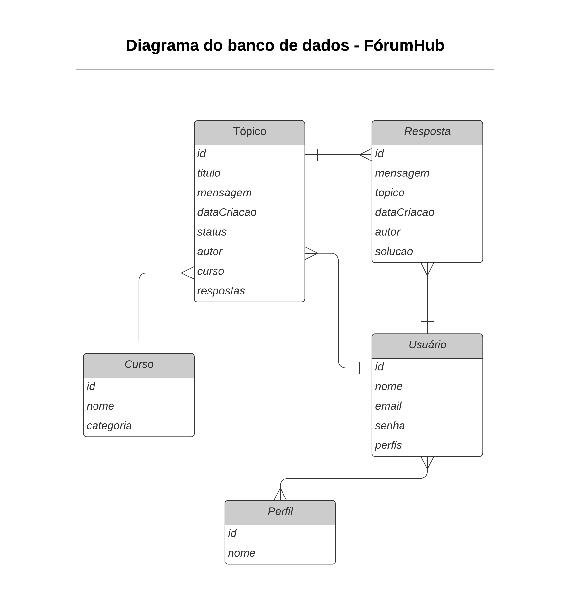
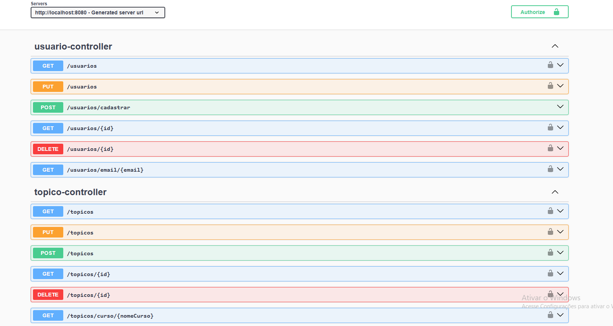

# 💬 ForumHub API

Uma API RESTful robusta desenvolvida em Java para o gerenciamento de um fórum de discussões. O projeto oferece um ambiente seguro para criação de tópicos, gerenciamento de respostas e controle de usuários, focado em boas práticas de engenharia de software.

## 🚀 Tecnologias Utilizadas

Este projeto foi construído com o ecossistema Spring e as seguintes tecnologias:

- **Java na versão 25**
- **Spring Boot 3** (Web, Data JPA, Validation)
- **Spring Security & JWT** (Autenticação, filtros de segurança e autorização)
- **BCrypt** (Criptografia de senhas)
- **Migrações de Banco de Dados** (Flyway / Liquibase)
- **JUnit 5 + Mock** (Testes automatizados da camada de domínio e rotas)

## ✨ Funcionalidades

A API do ForumHub vai muito além de um cadastro simples, implementando regras de negócio reais de uma comunidade digital:

- **Gestão de Tópicos (Postagens):** Criação de novas discussões detalhadas, vinculadas a categorias ou cursos específicos, permitindo que a comunidade troque conhecimento.
- **Sistema de Comentários e Respostas:** Interação dinâmica onde os usuários podem responder aos tópicos abertos por outros membros.
- **Marcação de Solução:** O autor do tópico pode eleger uma resposta específica e marcá-la como a "Solução" oficial, encerrando a dúvida e destacando a melhor contribuição para futuros leitores.
- **CRUD Completo e Estruturado:** Ciclo de vida completo (Create, Read, Update, Delete) implementado de forma segura para Usuários, Tópicos e Respostas.
- **Interações Anônimas:** Suporte exclusivo para postagens e comentários sem identificação pública, mapeando a autoria internamente para um perfil de sistema (ID `100`), garantindo a integridade relacional do banco de dados.
- **Consultas Otimizadas:** Listagem de tópicos e respostas com paginação e ordenação automática (ex: exibir os mais recentes ou os que ainda não foram resolvidos).
- **Segurança de Ponta a Ponta:** Autenticação via tokens JWT e senhas protegidas com BCrypt. Filtros de segurança garantem que apenas o autor de um tópico ou comentário (ou um administrador) possa editá-lo ou deletá-lo.
- **Exclusão Lógica (Soft Delete) e Integridade de Dados:** Para proteger o histórico do fórum, a API não realiza exclusões físicas (hard delete) no banco de dados. Tópicos e respostas excluídos pelos usuários são apenas inativados via *Soft Delete*. Isso garante a **integridade referencial** entre as tabelas (evitando que dados órfãos quebrem a aplicação), preserva informações cruciais para auditoria e permite a recuperação de conteúdos deletados acidentalmente.


## 🗄️ Arquitetura de Dados e Modelagem do Banco (ER)

O banco de dados do **ForumHub** foi projetado seguindo as regras de normalização para garantir consistência, performance e total integridade referencial. A estrutura mapeia o ecossistema completo de interações de uma comunidade digital de aprendizagem.

### 📊 Diagrama de Entidade-Relacionamento

Abaixo está a representação visual das tabelas, seus respectivos atributos e as conexões do sistema:



## 📖 Documentação da API (Swagger / OpenAPI)

A API do ForumHub possui uma documentação interativa e totalmente padronizada utilizando o **Swagger (Springdoc OpenAPI)**. Através dela, é possível visualizar todos os endpoints disponíveis, os schemas das entidades de requisição/resposta e testar as rotas em tempo real.


### Como acessar localmente:
1. Com a aplicação rodando, abra o seu navegador e acesse:
   ```text
   http://localhost:8080/swagger-ui/index.html


   Essa é a cereja do bolo! Mencionar testes automatizados e pipelines de CI/CD mostra que você tem uma mentalidade de engenharia de software madura, focada em qualidade e entrega contínua — características que as empresas procuram muito para vagas de nível Júnior e estágios.

Para deixar essa parte mais criativa e atrativa no repositório, utilizei uma abordagem visual focada em "blindagem de código" e "automação".

Aqui está o Markdown pronto para você adicionar ao seu README.md:

Markdown
## 🧪 Engenharia de Software e Qualidade: Testes Automatizados

Um código confiável é um código previsível. Para **blindar** as regras de negócio da API e garantir que novas funcionalidades não quebrem o ecossistema existente, o projeto conta com uma suíte de testes automatizados baseada nas melhores práticas do ecossistema Java.

* **Testes Unitários:** Utilização robusta do **JUnit** para validar a lógica de domínio, serviços e filtros de segurança de forma rápida e isolada.
* **Cobertura de Cenários:** Testes focados tanto no "caminho feliz" (sucesso esperado) quanto em cenários de falha e exceções (ex: tentativa de acesso não autorizado, manipulação de dados inválidos).

> **Quer ver os testes em ação?** > Para rodar a bateria de testes na sua máquina e visualizar o relatório do Maven, execute:
> ```bash
> ./mvnw test
> ```

---

## 🚀 O Futuro: Automação Total com CI/CD

Desenvolvimento moderno exige processos modernos. O próximo passo evolutivo para a arquitetura do **ForumHub** é a implementação de uma esteira automatizada utilizando **GitHub Actions**.

A pipeline de CI/CD (Integração e Entrega Contínua) transformará este repositório em um ambiente de nível de produção:

* 🛡️ **Integração Contínua (CI):** A cada novo *Push* ou *Pull Request*, os "robôs" do GitHub irão automaticamente compilar o código (Build), rodar todos os testes do JUnit e verificar a saúde da aplicação. Se um teste falhar, o código novo é barrado e não entra na branch principal.
* 📦 **Entrega Contínua (CD):** Com todos os testes aprovados no CI, a esteira irá gerar


# 🤝 Open Source: Sinta-se em casa!

Este projeto foi desenvolvido com muita dedicação para consolidar conhecimentos arquiteturais, mas a beleza da comunidade tech é que o código nunca está finalizado!

Este repositório é 100% **Open Source**. Se você encontrou alguma forma de otimizar uma consulta, melhorar a segurança ou simplesmente quer adicionar uma nova funcionalidade, sinta-se à vontade para colocar a mão na massa. Toda contribuição é super bem-vinda!

**Como contribuir:**
1. Faça um **Fork** do projeto.
2. Crie uma nova branch com a sua melhoria (`git checkout -b feature/minha-melhoria-incrivel`).
3. Faça o commit das suas alterações (`git commit -m 'feat: adicionando uma nova funcionalidade'`).
4. Envie o código para o seu fork (`git push origin feature/minha-melhoria-incrivel`).
5. Abra um **Pull Request** para este repositório! Vou adorar revisar o seu código, aprender com você e integrar a sua ideia.

E claro, se encontrar algum bug ou tiver alguma dúvida, basta abrir uma **Issue**. Vamos construir juntos! ☕💻

---

## 👨‍💻 Sobre o Desenvolvedor

**Wellerson Pinheiro dos Santos** *Desenvolvedor Back-end Java*

Sou apaixonado por tecnologia e por construir sistemas que sejam sólidos, seguros e escaláveis nos bastidores. Sou graduado em Análise e Desenvolvimento de Sistemas, atualmente estudante de Engenharia de Software na Uninter, e trago uma base técnica focada no ecossistema **Java** (Spring Boot, Spring Security, JPA/Hibernate, JUnit).

Além da paixão por escrever um bom código, estou sempre expandindo minha visão de arquitetura e infraestrutura (estudando ambientes em nuvem e conteinerização) para entender como as aplicações ganham vida no mundo real.

🚀 **Momento Atual:** Estou ativamente buscando oportunidades e desafios profissionais como **Desenvolvedor Java Júnior** ou **Estágio em Desenvolvimento Back-end**. Se a sua equipe busca alguém dedicado, com mentalidade de engenharia de software e que adora resolver problemas reais, vamos bater um papo!

📬 **Vamos nos conectar!**
- **LinkedIn:** [Acesse meu perfil e mande um 'Oi'](https://www.linkedin.com/in/wellerson-pinheiros/)
- **E-mail:** [Meu E-MAIL](mailto:wellerson.pinheiros@outlook.com)

---
⭐️ *Se este projeto te ajudou ou te inspirou de alguma forma, considere deixar uma estrela (star) no repositório!*

